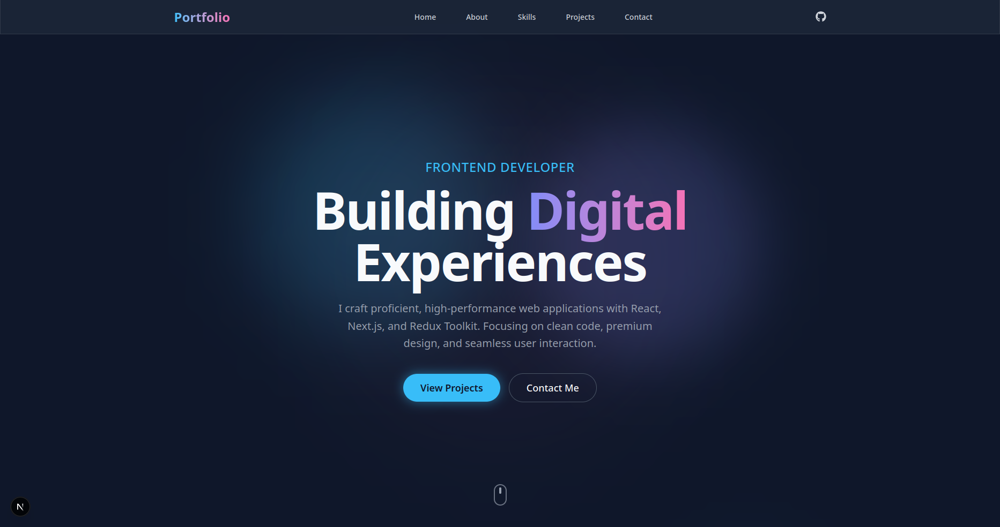

# Lalit's Personal Portfolio

A premium, high-performance personal portfolio website built with modern web technologies. This project showcases my skills, projects, and professional background with a focus on immersive design and smooth interactions.



## 🚀 Tech Stack

-   **Framework**: [Next.js 15](https://nextjs.org/) (App Router)
-   **Language**: [TypeScript](https://www.typescriptlang.org/)
-   **Styling**: [Tailwind CSS v4](https://tailwindcss.com/)
-   **State Management**: [Redux Toolkit](https://redux-toolkit.js.org/)
-   **Animations**: [Framer Motion](https://www.framer.com/motion/)
-   **Icons**: [React Icons](https://react-icons.github.io/react-icons/)

## ✨ Key Features

-   **💎 Glassmorphism Design**: deeply integrated glass-morphism aesthetic with custom blurs and transparencies.
-   **🎨 Dynamic Theme**: Premium dark mode with vibrant accent gradients.
-   **📱 Fully Responsive**: Optimized for all devices, featuring a custom full-screen mobile navigation drawer.
-   **🎢 Smooth Scrolling**: Native smooth scrolling with offset handling for fixed location headers.
-   **🔄 3D Interactions**: Tilt effects on project cards and entrance animations for section elements.
-   **⚡ High Performance**: Utilizing Next.js server components and optimized static assets.


## 📂 Project Structure

```bash
src/
├── app/              # Next.js App Router pages and layouts
├── components/       # Reusable UI components (Hero, Navbar, etc.)
├── features/         # Redux slices (theme, projects, skills)
├── lib/              # Utilities and Store configuration
└── styles/           # Global styles and tailwind configuration
```

## 📬 Contact & Socials

Feel free to reach out or connect with me:

-   **LinkedIn**: [www.linkedin.com/in/lalit-bijarnia](https://www.linkedin.com/in/lalit-bijarnia)
-   **GitHub**: [github.com/lk007-dev](https://github.com/lk007-dev/)
-   **Instagram**: [@lalitkumarbijarnia](https://www.instagram.com/lalitkumarbijarnia/)

## 📄 License

This project is open source and available under the [MIT License](LICENSE).
